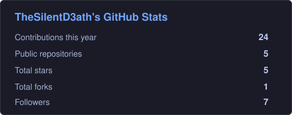
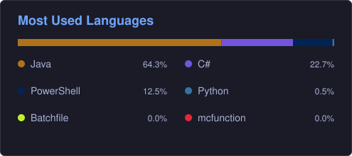

# Hii, I'm Lina :p

### aka Shiro1337 / TheSilentD3ath

22 y/o developer from Germany 🇩🇪  
Professional programmer socks wearer :3

I like building things, breaking things and then spending way too long figuring out why they broke.

---

## 💻 What I do

- 🐍 Python
- ☕ Java
- 💜 C#
- 🐧 Linux
- 🎮 Minecraft Modding
- 🥽 VRChat Development
- 🖥️ Homelab / Servers
- 🌐 Networking
- 🔧 Automation & Tooling

---

## 🚀 Projects

### 🌍 UtopiaMC
A huge Fabric Minecraft modpack I've been working on for quite a while.

- 500+ mods
- custom progression & balancing
- performance optimization
- custom tooling
- Modrinth / CurseForge ecosystem

### 🥽 VRChat Tools
Tools and experiments for making VRChat development less painful.

Including things like:
- outfit batch uploading
- Unity automation
- avatar workflow tools

### 🏠 Homelab
Because apparently owning one computer wasn't enough.

I run my own server infrastructure with things like:

- Proxmox
- Docker
- WireGuard
- Reverse proxies
- Mail infrastructure
- Windows & Linux VMs

---

## 🛠️ Languages & Tools

---

## 🦈 About me

- 👩 she/her
- 🇩🇪 Germany
- 🐧 Linux enjoyer
- 🥽 spends an unreasonable amount of time in VR
- 🦈 BLÅHAJ enthusiast
- 🧦 powered by programmer socks
- 🔧 probably working on another project instead of finishing the previous one

---

## 📊 GitHub Stats

---

### 💬 You can ask me about

Minecraft modding • Python • Java • C# • Linux • VRChat • Homelabs • Networking

> If something can be automated, I will probably try to automate it.